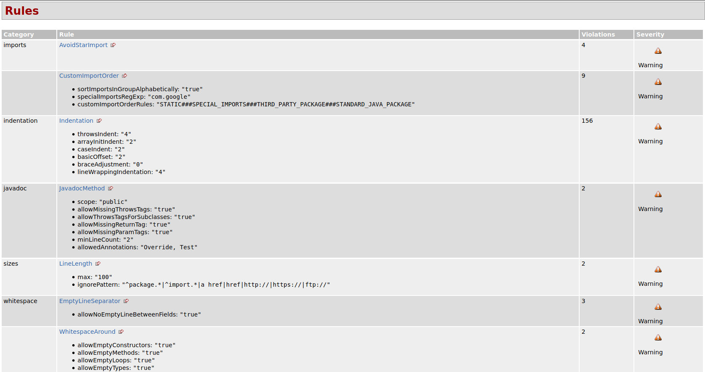
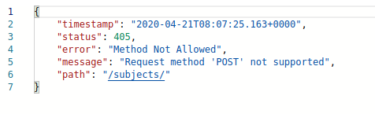
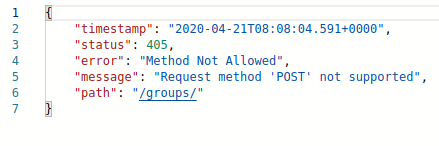

# Spring

# Code Review
## Plugin results
1. Checkstyle detected indentation, custom order imports, and imports with star
2. PMD detected unused imports 
## Fixes
1. Removed comments in Subject model
2. Reorganized imports
3. Fixed star imports
## Checkstyle results

## Recommendations
1. Add CRUD functionality to Subject and Group in controllers
2. Remove HashMap completely from StudentsController
## Misconfiguration
1. Some methods do not work for Subject and Group, therefore I am unable to test them
### POST method on Subjects

### POST method on Groups

